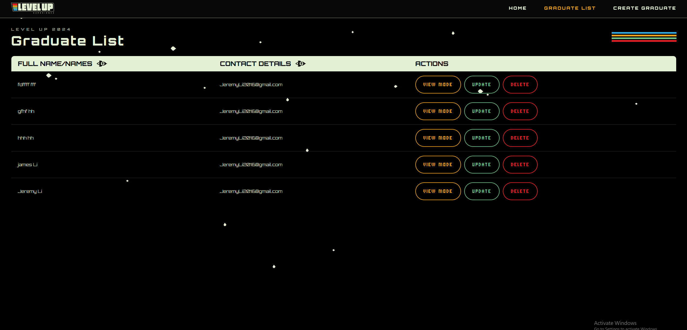
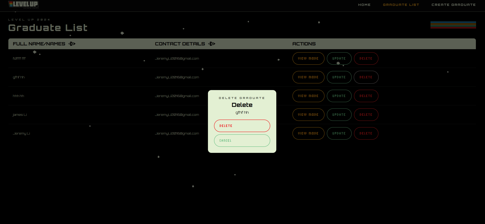
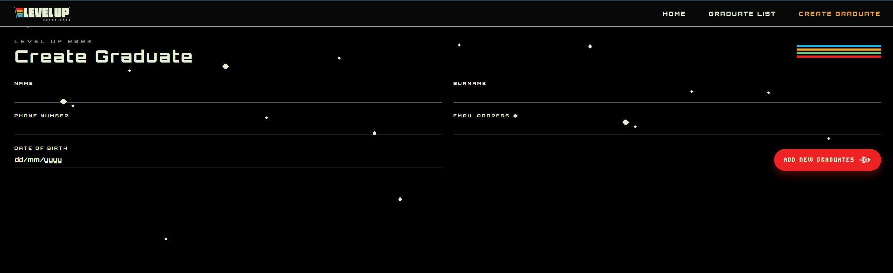

# LevelUp

Full-stack Level Up assessment with a React frontend and an ASP.NET Core Web API backend.

## Repo layout
- `_LevelUpAssessment/`: React frontend (CRA).
- `backend/LevelUp.Api/`: ASP.NET Core Web API.

## Prerequisites
- Node.js 18+ (npm included)
- .NET SDK 10.0+

## Frontend
From the repo root:
```
cd _LevelUpAssessment
npm install
npm start
```

The app runs on `http://localhost:3000`.

### Configure API base URL
The frontend calls `http://localhost:5234` by default. To override:
```
set REACT_APP_API_BASE_URL=http://localhost:5234
```
Restart the dev server after changing env vars.

## Backend
From the repo root:
```
cd backend/LevelUp.Api
dotnet restore
dotnet run
```

The API runs on `http://localhost:5234` and allows CORS from `http://localhost:3000`.
Swagger UI: `http://localhost:5234/swagger`.

## Screenshots
Homepage:


Graduate list:


Delete confirmation:


Create graduate:


## Notes
- The API uses an in-memory database, so data resets on restart.
- See `_LevelUpAssessment/README.md` for frontend design references.
